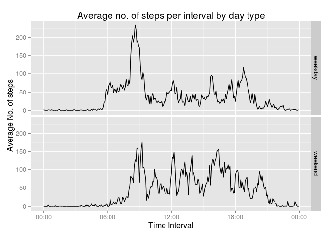

# Reproducible Research: Peer Assessment 1


```r
options(scipen = 1, digits = 2)
knitr::opts_chunk$set(echo=TRUE, fig.path='figure/PA1-', cache=FALSE)
```

## Loading and preprocessing the data
Load and prepare the data:
1. load the data: Check if the data exists and if not download, expand it, and load it into activity data.frame


```r
setwd("/home/ahmaddamra/Coursera/0050-ReproducibleResearch/peerassignment1/RepData_PeerAssessment1")
if (! file.exists("./activity.zip")){
  fileUrl <- "https://d396qusza40orc.cloudfront.net/repdata%2Fdata%2Factivity.zip"
  download.file(fileUrl, destfile="./activity.zip", method="curl")
}

if (! file.exists("./activity.csv")){
  unzip("./activity.zip", files = NULL, list = FALSE, overwrite = TRUE,
        junkpaths = FALSE, exdir = "./", unzip = "internal",
        setTimes = FALSE)
}

activity <- read.csv("./activity.csv", sep=",", na.strings="NA")
```

2. prepare data for processing: convert activity data.frame into a  data.table. 


```r
library(data.table)
activity <- data.table(activity)
```


## What is mean total number of steps taken per day?
1. Calculate the total number of steps per day:

```r
ActivityByDay <- activity[, sum(steps), by = date]
setnames(ActivityByDay,c("Date","TotalSteps"))
library(xtable)
xt <- xtable(ActivityByDay)
print(xt, type = "html")
```

<!-- html table generated in R 3.1.2 by xtable 1.7-4 package -->
<!-- Sat Mar 14 17:06:16 2015 -->
<table border=1>
<tr> <th>  </th> <th> Date </th> <th> TotalSteps </th>  </tr>
  <tr> <td align="right"> 1 </td> <td> 2012-10-01 </td> <td align="right">  </td> </tr>
  <tr> <td align="right"> 2 </td> <td> 2012-10-02 </td> <td align="right"> 126 </td> </tr>
  <tr> <td align="right"> 3 </td> <td> 2012-10-03 </td> <td align="right"> 11352 </td> </tr>
  <tr> <td align="right"> 4 </td> <td> 2012-10-04 </td> <td align="right"> 12116 </td> </tr>
  <tr> <td align="right"> 5 </td> <td> 2012-10-05 </td> <td align="right"> 13294 </td> </tr>
  <tr> <td align="right"> 6 </td> <td> 2012-10-06 </td> <td align="right"> 15420 </td> </tr>
  <tr> <td align="right"> 7 </td> <td> 2012-10-07 </td> <td align="right"> 11015 </td> </tr>
  <tr> <td align="right"> 8 </td> <td> 2012-10-08 </td> <td align="right">  </td> </tr>
  <tr> <td align="right"> 9 </td> <td> 2012-10-09 </td> <td align="right"> 12811 </td> </tr>
  <tr> <td align="right"> 10 </td> <td> 2012-10-10 </td> <td align="right"> 9900 </td> </tr>
  <tr> <td align="right"> 11 </td> <td> 2012-10-11 </td> <td align="right"> 10304 </td> </tr>
  <tr> <td align="right"> 12 </td> <td> 2012-10-12 </td> <td align="right"> 17382 </td> </tr>
  <tr> <td align="right"> 13 </td> <td> 2012-10-13 </td> <td align="right"> 12426 </td> </tr>
  <tr> <td align="right"> 14 </td> <td> 2012-10-14 </td> <td align="right"> 15098 </td> </tr>
  <tr> <td align="right"> 15 </td> <td> 2012-10-15 </td> <td align="right"> 10139 </td> </tr>
  <tr> <td align="right"> 16 </td> <td> 2012-10-16 </td> <td align="right"> 15084 </td> </tr>
  <tr> <td align="right"> 17 </td> <td> 2012-10-17 </td> <td align="right"> 13452 </td> </tr>
  <tr> <td align="right"> 18 </td> <td> 2012-10-18 </td> <td align="right"> 10056 </td> </tr>
  <tr> <td align="right"> 19 </td> <td> 2012-10-19 </td> <td align="right"> 11829 </td> </tr>
  <tr> <td align="right"> 20 </td> <td> 2012-10-20 </td> <td align="right"> 10395 </td> </tr>
  <tr> <td align="right"> 21 </td> <td> 2012-10-21 </td> <td align="right"> 8821 </td> </tr>
  <tr> <td align="right"> 22 </td> <td> 2012-10-22 </td> <td align="right"> 13460 </td> </tr>
  <tr> <td align="right"> 23 </td> <td> 2012-10-23 </td> <td align="right"> 8918 </td> </tr>
  <tr> <td align="right"> 24 </td> <td> 2012-10-24 </td> <td align="right"> 8355 </td> </tr>
  <tr> <td align="right"> 25 </td> <td> 2012-10-25 </td> <td align="right"> 2492 </td> </tr>
  <tr> <td align="right"> 26 </td> <td> 2012-10-26 </td> <td align="right"> 6778 </td> </tr>
  <tr> <td align="right"> 27 </td> <td> 2012-10-27 </td> <td align="right"> 10119 </td> </tr>
  <tr> <td align="right"> 28 </td> <td> 2012-10-28 </td> <td align="right"> 11458 </td> </tr>
  <tr> <td align="right"> 29 </td> <td> 2012-10-29 </td> <td align="right"> 5018 </td> </tr>
  <tr> <td align="right"> 30 </td> <td> 2012-10-30 </td> <td align="right"> 9819 </td> </tr>
  <tr> <td align="right"> 31 </td> <td> 2012-10-31 </td> <td align="right"> 15414 </td> </tr>
  <tr> <td align="right"> 32 </td> <td> 2012-11-01 </td> <td align="right">  </td> </tr>
  <tr> <td align="right"> 33 </td> <td> 2012-11-02 </td> <td align="right"> 10600 </td> </tr>
  <tr> <td align="right"> 34 </td> <td> 2012-11-03 </td> <td align="right"> 10571 </td> </tr>
  <tr> <td align="right"> 35 </td> <td> 2012-11-04 </td> <td align="right">  </td> </tr>
  <tr> <td align="right"> 36 </td> <td> 2012-11-05 </td> <td align="right"> 10439 </td> </tr>
  <tr> <td align="right"> 37 </td> <td> 2012-11-06 </td> <td align="right"> 8334 </td> </tr>
  <tr> <td align="right"> 38 </td> <td> 2012-11-07 </td> <td align="right"> 12883 </td> </tr>
  <tr> <td align="right"> 39 </td> <td> 2012-11-08 </td> <td align="right"> 3219 </td> </tr>
  <tr> <td align="right"> 40 </td> <td> 2012-11-09 </td> <td align="right">  </td> </tr>
  <tr> <td align="right"> 41 </td> <td> 2012-11-10 </td> <td align="right">  </td> </tr>
  <tr> <td align="right"> 42 </td> <td> 2012-11-11 </td> <td align="right"> 12608 </td> </tr>
  <tr> <td align="right"> 43 </td> <td> 2012-11-12 </td> <td align="right"> 10765 </td> </tr>
  <tr> <td align="right"> 44 </td> <td> 2012-11-13 </td> <td align="right"> 7336 </td> </tr>
  <tr> <td align="right"> 45 </td> <td> 2012-11-14 </td> <td align="right">  </td> </tr>
  <tr> <td align="right"> 46 </td> <td> 2012-11-15 </td> <td align="right">  41 </td> </tr>
  <tr> <td align="right"> 47 </td> <td> 2012-11-16 </td> <td align="right"> 5441 </td> </tr>
  <tr> <td align="right"> 48 </td> <td> 2012-11-17 </td> <td align="right"> 14339 </td> </tr>
  <tr> <td align="right"> 49 </td> <td> 2012-11-18 </td> <td align="right"> 15110 </td> </tr>
  <tr> <td align="right"> 50 </td> <td> 2012-11-19 </td> <td align="right"> 8841 </td> </tr>
  <tr> <td align="right"> 51 </td> <td> 2012-11-20 </td> <td align="right"> 4472 </td> </tr>
  <tr> <td align="right"> 52 </td> <td> 2012-11-21 </td> <td align="right"> 12787 </td> </tr>
  <tr> <td align="right"> 53 </td> <td> 2012-11-22 </td> <td align="right"> 20427 </td> </tr>
  <tr> <td align="right"> 54 </td> <td> 2012-11-23 </td> <td align="right"> 21194 </td> </tr>
  <tr> <td align="right"> 55 </td> <td> 2012-11-24 </td> <td align="right"> 14478 </td> </tr>
  <tr> <td align="right"> 56 </td> <td> 2012-11-25 </td> <td align="right"> 11834 </td> </tr>
  <tr> <td align="right"> 57 </td> <td> 2012-11-26 </td> <td align="right"> 11162 </td> </tr>
  <tr> <td align="right"> 58 </td> <td> 2012-11-27 </td> <td align="right"> 13646 </td> </tr>
  <tr> <td align="right"> 59 </td> <td> 2012-11-28 </td> <td align="right"> 10183 </td> </tr>
  <tr> <td align="right"> 60 </td> <td> 2012-11-29 </td> <td align="right"> 7047 </td> </tr>
  <tr> <td align="right"> 61 </td> <td> 2012-11-30 </td> <td align="right">  </td> </tr>
   </table>

2. Histogram of the total number of steps taken per day

```r
hist(ActivityByDay$TotalSteps, main = "Total number of steps taken per day", xlab="Total no. steps/day", ylab="Frequency")
```

 

3. The mean and median of the total number of steps taken per day

```r
activitymean <- mean(ActivityByDay$TotalSteps,  na.rm = TRUE)

activitymedian <- median(ActivityByDay$TotalSteps,  na.rm = TRUE)
```

The mean of the total number of steps taken per day is 10766.19  
The median of the total number of steps taken per day is 10765  

## What is the average daily activity pattern?
1. A Time series plot of the 5-minute interval and the average number of steps taken, averaged across all days


```r
library(lubridate)
library(stringr)

## calculate the mean steps by interval 
ActivityByInterval <- activity[, mean(steps,na.rm = TRUE), by = interval]

x <- ymd("2012-10-01")

## Add a new variable that is a date/time variable
ActivityByInterval[,ts:=x+hm(gsub('^([a-z0-9]{2})([a-z0-9]+)$', '\\1:\\2', str_pad(ActivityByInterval$interval, 4, pad = "0")))]
```

```
##      interval    V1                  ts
##   1:        0 1.717 2012-10-01 00:00:00
##   2:        5 0.340 2012-10-01 00:05:00
##   3:       10 0.132 2012-10-01 00:10:00
##   4:       15 0.151 2012-10-01 00:15:00
##   5:       20 0.075 2012-10-01 00:20:00
##  ---                                   
## 284:     2335 4.698 2012-10-01 23:35:00
## 285:     2340 3.302 2012-10-01 23:40:00
## 286:     2345 0.642 2012-10-01 23:45:00
## 287:     2350 0.226 2012-10-01 23:50:00
## 288:     2355 1.075 2012-10-01 23:55:00
```

```r
setnames(ActivityByInterval,c("Interval","AverageSteps","Time"))


plot(ActivityByInterval$Time,ActivityByInterval$AverageSteps,type = "l", main = "Average steps per Interval", xlab="Intervals as time of day", ylab="Average Steps")
```

 


2. Which 5-minute interval, on average across all the days in the dataset, contains the maximum number of steps?

```r
ActivityByInterval[AverageSteps==max(ActivityByInterval$AverageSteps),1:2, with = FALSE]
```

```
##    Interval AverageSteps
## 1:      835          206
```

## Imputing missing values
1. The total number of missing values in the dataset 

```r
nrow(activity[is.na(steps),])
```

```
## [1] 2304
```

2. Devise a strategy for filling in all of the missing values in the dataset. The strategy does not need to be sophisticated. For example, you could use the mean/median for that day, or the mean for that 5-minute interval, etc.

since we have 8 full missing days. We will use the mean for that 5-minute interval to fill the missing values

3. Create a new dataset that is equal to the original dataset but with the missing data filled in.


```r
activitynoNA = copy(activity)

activitynoNA[is.na(steps),steps:=ActivityByInterval[Interval==interval,as.integer(AverageSteps)]]
```

```
##        steps       date interval
##     1:     1 2012-10-01        0
##     2:     0 2012-10-01        5
##     3:     0 2012-10-01       10
##     4:     0 2012-10-01       15
##     5:     0 2012-10-01       20
##    ---                          
## 17564:     4 2012-11-30     2335
## 17565:     3 2012-11-30     2340
## 17566:     0 2012-11-30     2345
## 17567:     0 2012-11-30     2350
## 17568:     1 2012-11-30     2355
```

```r
activitynoNA[is.na(steps)]
```

```
## Empty data.table (0 rows) of 3 cols: steps,date,interval
```

4. Make a histogram of the total number of steps taken each day and Calculate and report the **mean** and **median** total number of steps taken per day. Do these values differ from the estimates from the first part of the assignment? What is the impact of imputing missing data on the estimates of the total daily number of steps?


```r
ActivityByDaynoNA <- activitynoNA[, sum(steps), by = date]
setnames(ActivityByDaynoNA,c("Date","TotalSteps"))
library(xtable)
xt <- xtable(ActivityByDaynoNA)
print(xt, type = "html")
```

<!-- html table generated in R 3.1.2 by xtable 1.7-4 package -->
<!-- Sat Mar 14 17:06:17 2015 -->
<table border=1>
<tr> <th>  </th> <th> Date </th> <th> TotalSteps </th>  </tr>
  <tr> <td align="right"> 1 </td> <td> 2012-10-01 </td> <td align="right"> 10641 </td> </tr>
  <tr> <td align="right"> 2 </td> <td> 2012-10-02 </td> <td align="right"> 126 </td> </tr>
  <tr> <td align="right"> 3 </td> <td> 2012-10-03 </td> <td align="right"> 11352 </td> </tr>
  <tr> <td align="right"> 4 </td> <td> 2012-10-04 </td> <td align="right"> 12116 </td> </tr>
  <tr> <td align="right"> 5 </td> <td> 2012-10-05 </td> <td align="right"> 13294 </td> </tr>
  <tr> <td align="right"> 6 </td> <td> 2012-10-06 </td> <td align="right"> 15420 </td> </tr>
  <tr> <td align="right"> 7 </td> <td> 2012-10-07 </td> <td align="right"> 11015 </td> </tr>
  <tr> <td align="right"> 8 </td> <td> 2012-10-08 </td> <td align="right"> 10641 </td> </tr>
  <tr> <td align="right"> 9 </td> <td> 2012-10-09 </td> <td align="right"> 12811 </td> </tr>
  <tr> <td align="right"> 10 </td> <td> 2012-10-10 </td> <td align="right"> 9900 </td> </tr>
  <tr> <td align="right"> 11 </td> <td> 2012-10-11 </td> <td align="right"> 10304 </td> </tr>
  <tr> <td align="right"> 12 </td> <td> 2012-10-12 </td> <td align="right"> 17382 </td> </tr>
  <tr> <td align="right"> 13 </td> <td> 2012-10-13 </td> <td align="right"> 12426 </td> </tr>
  <tr> <td align="right"> 14 </td> <td> 2012-10-14 </td> <td align="right"> 15098 </td> </tr>
  <tr> <td align="right"> 15 </td> <td> 2012-10-15 </td> <td align="right"> 10139 </td> </tr>
  <tr> <td align="right"> 16 </td> <td> 2012-10-16 </td> <td align="right"> 15084 </td> </tr>
  <tr> <td align="right"> 17 </td> <td> 2012-10-17 </td> <td align="right"> 13452 </td> </tr>
  <tr> <td align="right"> 18 </td> <td> 2012-10-18 </td> <td align="right"> 10056 </td> </tr>
  <tr> <td align="right"> 19 </td> <td> 2012-10-19 </td> <td align="right"> 11829 </td> </tr>
  <tr> <td align="right"> 20 </td> <td> 2012-10-20 </td> <td align="right"> 10395 </td> </tr>
  <tr> <td align="right"> 21 </td> <td> 2012-10-21 </td> <td align="right"> 8821 </td> </tr>
  <tr> <td align="right"> 22 </td> <td> 2012-10-22 </td> <td align="right"> 13460 </td> </tr>
  <tr> <td align="right"> 23 </td> <td> 2012-10-23 </td> <td align="right"> 8918 </td> </tr>
  <tr> <td align="right"> 24 </td> <td> 2012-10-24 </td> <td align="right"> 8355 </td> </tr>
  <tr> <td align="right"> 25 </td> <td> 2012-10-25 </td> <td align="right"> 2492 </td> </tr>
  <tr> <td align="right"> 26 </td> <td> 2012-10-26 </td> <td align="right"> 6778 </td> </tr>
  <tr> <td align="right"> 27 </td> <td> 2012-10-27 </td> <td align="right"> 10119 </td> </tr>
  <tr> <td align="right"> 28 </td> <td> 2012-10-28 </td> <td align="right"> 11458 </td> </tr>
  <tr> <td align="right"> 29 </td> <td> 2012-10-29 </td> <td align="right"> 5018 </td> </tr>
  <tr> <td align="right"> 30 </td> <td> 2012-10-30 </td> <td align="right"> 9819 </td> </tr>
  <tr> <td align="right"> 31 </td> <td> 2012-10-31 </td> <td align="right"> 15414 </td> </tr>
  <tr> <td align="right"> 32 </td> <td> 2012-11-01 </td> <td align="right"> 10641 </td> </tr>
  <tr> <td align="right"> 33 </td> <td> 2012-11-02 </td> <td align="right"> 10600 </td> </tr>
  <tr> <td align="right"> 34 </td> <td> 2012-11-03 </td> <td align="right"> 10571 </td> </tr>
  <tr> <td align="right"> 35 </td> <td> 2012-11-04 </td> <td align="right"> 10641 </td> </tr>
  <tr> <td align="right"> 36 </td> <td> 2012-11-05 </td> <td align="right"> 10439 </td> </tr>
  <tr> <td align="right"> 37 </td> <td> 2012-11-06 </td> <td align="right"> 8334 </td> </tr>
  <tr> <td align="right"> 38 </td> <td> 2012-11-07 </td> <td align="right"> 12883 </td> </tr>
  <tr> <td align="right"> 39 </td> <td> 2012-11-08 </td> <td align="right"> 3219 </td> </tr>
  <tr> <td align="right"> 40 </td> <td> 2012-11-09 </td> <td align="right"> 10641 </td> </tr>
  <tr> <td align="right"> 41 </td> <td> 2012-11-10 </td> <td align="right"> 10641 </td> </tr>
  <tr> <td align="right"> 42 </td> <td> 2012-11-11 </td> <td align="right"> 12608 </td> </tr>
  <tr> <td align="right"> 43 </td> <td> 2012-11-12 </td> <td align="right"> 10765 </td> </tr>
  <tr> <td align="right"> 44 </td> <td> 2012-11-13 </td> <td align="right"> 7336 </td> </tr>
  <tr> <td align="right"> 45 </td> <td> 2012-11-14 </td> <td align="right"> 10641 </td> </tr>
  <tr> <td align="right"> 46 </td> <td> 2012-11-15 </td> <td align="right">  41 </td> </tr>
  <tr> <td align="right"> 47 </td> <td> 2012-11-16 </td> <td align="right"> 5441 </td> </tr>
  <tr> <td align="right"> 48 </td> <td> 2012-11-17 </td> <td align="right"> 14339 </td> </tr>
  <tr> <td align="right"> 49 </td> <td> 2012-11-18 </td> <td align="right"> 15110 </td> </tr>
  <tr> <td align="right"> 50 </td> <td> 2012-11-19 </td> <td align="right"> 8841 </td> </tr>
  <tr> <td align="right"> 51 </td> <td> 2012-11-20 </td> <td align="right"> 4472 </td> </tr>
  <tr> <td align="right"> 52 </td> <td> 2012-11-21 </td> <td align="right"> 12787 </td> </tr>
  <tr> <td align="right"> 53 </td> <td> 2012-11-22 </td> <td align="right"> 20427 </td> </tr>
  <tr> <td align="right"> 54 </td> <td> 2012-11-23 </td> <td align="right"> 21194 </td> </tr>
  <tr> <td align="right"> 55 </td> <td> 2012-11-24 </td> <td align="right"> 14478 </td> </tr>
  <tr> <td align="right"> 56 </td> <td> 2012-11-25 </td> <td align="right"> 11834 </td> </tr>
  <tr> <td align="right"> 57 </td> <td> 2012-11-26 </td> <td align="right"> 11162 </td> </tr>
  <tr> <td align="right"> 58 </td> <td> 2012-11-27 </td> <td align="right"> 13646 </td> </tr>
  <tr> <td align="right"> 59 </td> <td> 2012-11-28 </td> <td align="right"> 10183 </td> </tr>
  <tr> <td align="right"> 60 </td> <td> 2012-11-29 </td> <td align="right"> 7047 </td> </tr>
  <tr> <td align="right"> 61 </td> <td> 2012-11-30 </td> <td align="right"> 10641 </td> </tr>
   </table>


```r
hist(ActivityByDaynoNA$TotalSteps, main = "Total number of steps taken per day", xlab="Total no. steps/day", ylab="Frequency")
```

 


```r
activitymeannoNA <- mean(ActivityByDaynoNA$TotalSteps,  na.rm = TRUE)

activitymediannoNA <- median(ActivityByDaynoNA$TotalSteps,  na.rm = TRUE)
```

The mean of the total number of steps taken per day is 10749.77  
The median of the total number of steps taken per day is 10641 

The frequency of intervals increased, the mean and median both decreased. The median showed a big change.

## Are there differences in activity patterns between weekdays and weekends?

1. Create a new factor variable in the dataset with two levels -- "weekday" and "weekend" indicating whether a given date is a weekday or weekend day.


```r
activitywkdy = copy(activity)
weekend <- c('Sat','Sun')
tt <- wday(activitywkdy$date,label = TRUE)
zz <- ifelse (tt %in% weekend,"weekend","weekday")
activitywkdy$daytype <- zz
activitywkdy <- transform(activitywkdy, daytype = factor(daytype))
```

2. Make a panel plot containing a time series plot of the 5-minute interval  and the average number of steps taken, averaged across all weekday days or weekend days:


```r
## calculate the mean steps by interval 
ActivityBydaytype <- activitywkdy[, mean(steps,na.rm = TRUE), by = c("daytype","interval")]

x <- ymd("2012-10-01")
ActivityBydaytype[,ts:=x+hm(gsub('^([a-z0-9]{2})([a-z0-9]+)$', '\\1:\\2', str_pad(ActivityBydaytype$interval, 4, pad = "0")))]
```

```
##      daytype interval    V1                  ts
##   1: weekday        0  2.33 2012-10-01 00:00:00
##   2: weekday        5  0.46 2012-10-01 00:05:00
##   3: weekday       10  0.18 2012-10-01 00:10:00
##   4: weekday       15  0.21 2012-10-01 00:15:00
##   5: weekday       20  0.10 2012-10-01 00:20:00
##  ---                                           
## 572: weekend     2335 12.57 2012-10-01 23:35:00
## 573: weekend     2340  6.71 2012-10-01 23:40:00
## 574: weekend     2345  1.86 2012-10-01 23:45:00
## 575: weekend     2350  0.00 2012-10-01 23:50:00
## 576: weekend     2355  0.00 2012-10-01 23:55:00
```

```r
setnames(ActivityBydaytype,c("DayType","Interval","AverageSteps","Time"))

library(ggplot2)
library(scales)

sp <- ggplot(ActivityBydaytype, aes(x=Time, y=AverageSteps)) + geom_line() +
facet_grid(DayType ~ .) +
xlab("Time Interval") + ylab("Average No. of steps") +
ggtitle("Average no. of steps per interval by day type") + 
  scale_x_datetime(labels=date_format("%H:%M"))

sp
```

 
